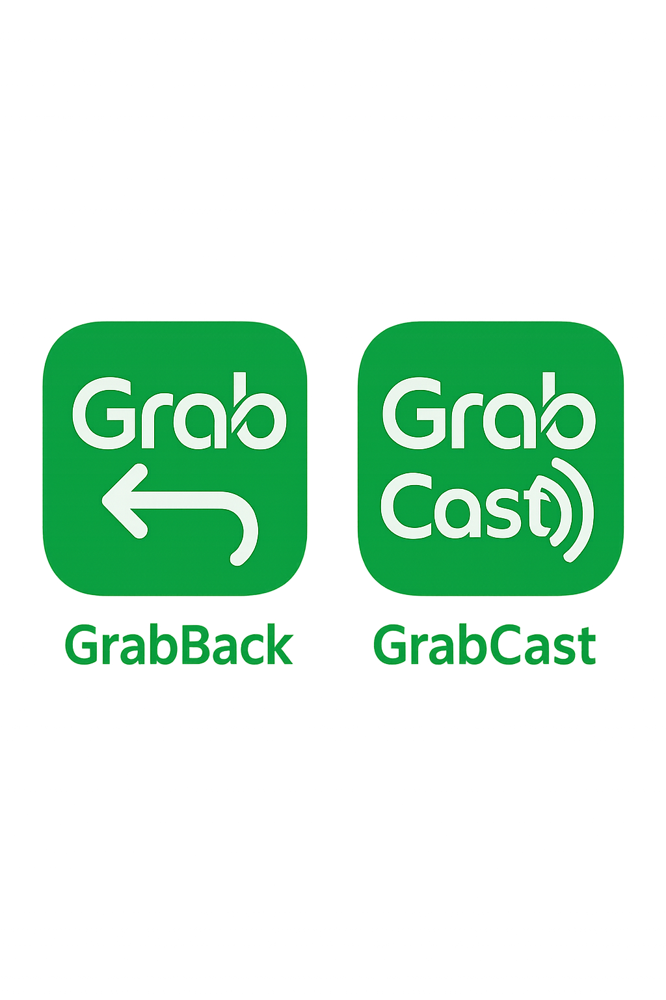

<p align="center">
  
</p>
<p align="center">
  <a href="#"></a>
  <a href="#"></a>
  <a href="#"></a>
  <a href="#"></a>
</p>
<p align="center">
  Run LLM apps locally using FastAPI and Ollama. Designed for hackathon speed, production stability, and AI-first development.
</p>

# 🏆 Submission for UM Hackathon 2024 🏆

This repository contains our project submission for the University of Malaya Hackathon.

**Key Resources:**

*   🎨 **Prototype:** [Figma Prototype](https://www.figma.com/proto/SRxrtm9e8qbYJe3jPzHSmM/UMHackathon?node-id=21-610&p=f&t=2kfCQp9856B8CqSh-0&scaling=scale-down&content-scaling=fixed&page-id=0%3A1&starting-point-node-id=21%3A610)
*   📄 **Documentation:** [Google Docs](https://docs.google.com/document/d/1mhMB6jfrt9OWpvGafP0qIJ3PaWjJl8cj9_oNQASEMHc/edit?usp=sharing)

---

## 🚀 Getting Started

### Front-End Setup

Make sure you have the latest Node.js installed:
```bash
node --version
```

Navigate to the frontend directory (if applicable) and install dependencies:
```bash
# cd frontend/  (if you have a separate directory)
npm install
```

Run the front-end server:
```bash
npm run dev
```

### Back-End Setup

You’ll need **Python 3.11+** installed. Then run:
```bash
pipx install uv
```

Navigate to the backend directory (if applicable) and install dependencies using `uv`:
```bash
# cd backend/ (if you have a separate directory)
uv pip install -r requirements.txt
```

**Install Ollama:**

Download and install Ollama for your operating system from the official website:
[https://ollama.com](https://ollama.com)

Once installed, pull the required LLM model (we use `llama3`):
```bash
ollama pull llama3
```

Ensure the Ollama application/server is running in the background.

**Run the FastAPI Server:**

```bash
fastapi dev .\main.py --port 9000
```

---

## ⚙️ Tech Stack Overview

### Front-End
- **React** with **Mantine** UI framework

### Back-End
- **FastAPI** for API logic and routing
- **Ollama** for local LLM integration

### Storage
- **PostgreSQL** for persistent relational data
- **CSV files** for lightweight tabular data ingestion/export

### Infrastructure
- **Docker** to containerize services
- **Nginx** as the reverse proxy/load balancer

---

## 📹 In Action

<div align="center">

  <p><h3>🎬 0. AI Intent Detection</h3>
  "It all begins with understanding your goals. Our AI reads your intent—whether you're aiming for sales, discounts, or retention—and guides you to the right tools instantly."
  <video controls muted src="public/00.mp4"></video></p>

  <p><h3>🎬 1. Generate Sales Forecast</h3>
  "Kick off your business strategy by generating AI-powered sales forecasts using synthetic data and supervised learning models. See tomorrow’s demand—today."
  <video controls muted src="public/01.mp4"></video></p>

  <p><h3>🎬 2. Plan Food Staging</h3>
  "Turn those forecasts into action. Use predictive insights to plan food staging, tap into warehousing APIs, and boost your delivery range and customer reach."
  <video controls muted src="public/02.mp4"></video></p>

  <p><h3>🎬 3. Identify Inactive Customers</h3>
  "Discover who hasn’t come back. Dive into backend data to find customers who’ve stopped reordering—and start planning your win-back strategy."
  <video controls muted src="public/03.mp4"></video></p>

  <p><h3>🎬 4. Draft Retention Messages</h3>
  "Don’t just find them—bring them back. Automatically craft tailored messages based on past order behavior to re-engage loyal customers and spark new sales."
  <video controls muted src="public/04.mp4"></video></p>

  <!-- Uncomment and add title/description if you have a video 05.mp4 -->
  <!-- <p><h3>🎬 5. [Title for Video 5]</h3>
  "[Description for Video 5]"
  <video controls muted src="https://github.com/user-attachments/assets/05.mp4"></video></p> -->

</div>

---

## 📚 Documentation & Tutorials

Visit our [docs folder](./docs) for detailed usage and API documentation.

### Troubleshooting

**Check Python & Node Versions**
```bash
python --version
node --version
```

**Reinstall Python Dependencies**
```bash
uv pip install -r requirements.txt
```

**Run in Clean Environment**
```bash
uv venv --recreate
```
**Check Ollama Status**
(Ensure the Ollama application/server is running)

---

## 🙌 Contributing

We welcome issues, discussions, and pull requests. Please open a discussion before submitting a large PR.

Make sure to follow our [contributing guidelines](./CONTRIBUTING.md) and test using the `minimal_run.sh` script.

---

## 👏 Acknowledgements

Thanks to the maintainers and toolmakers across the Python and JS ecosystem. Inspired by:
- [FastAPI](https://fastapi.tiangolo.com/)
- [Ollama](https://ollama.com)
- [Mantine](https://mantine.dev)
